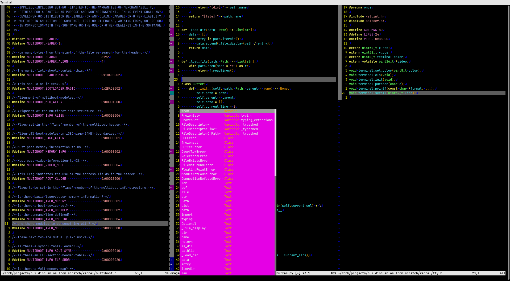

# Dotfiles

This repository contains my personal configuration files and setup scripts for tools like Neovim, Tmux, and other terminal-based utilities. It allows for quick setup of my preferred development environment on a new Ubuntu machine.

## Appearance



## Structure

```plaintext
dotfiles/
├── Dockerfile           # Dockerfile to test the installation in a container
├── install.sh           # Installation script to set up the environment
├── apt_packages.txt     # List of apt packages to install
├── .config/
│   ├── nvim/            # Neovim configuration file
│   ├── .bashrc          # Bash configuration
│   └── .tmux.conf       # Tmux configuration
└── README.md
```

### Files:
- **`install.sh`**: The installation script that sets up all necessary symlinks and installs required packages.
- **`apt_packages.txt`**: A list of all the packages installed via `apt-get`.
- **`.config/`**: Config files from different tools.

## Installation

To install this setup on a new machine:

1. Clone the repository:

   ```bash
   git clone https://github.com/yourusername/dotfiles.git
   cd dotfiles
   ```

2. Run the installation script:

   ```bash
   chmod +x install.sh
   ./install.sh
   ```

This script will install all necessary packages and symlink the config files to the correct locations.

## Testing in Docker

You can use Docker to test the setup in a clean environment without affecting your system:

Build and run a test docker container using the following command.

```bash
./test_setup.sh
```

This will create a container with the setup, and you can test all the configurations within it.

